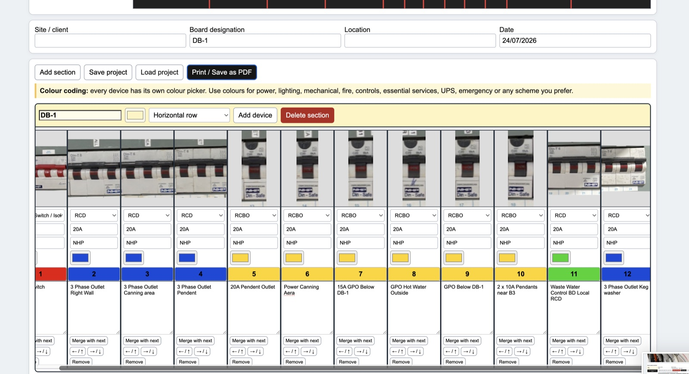
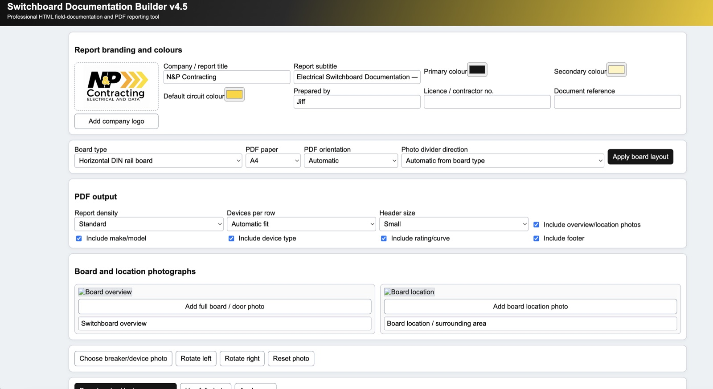
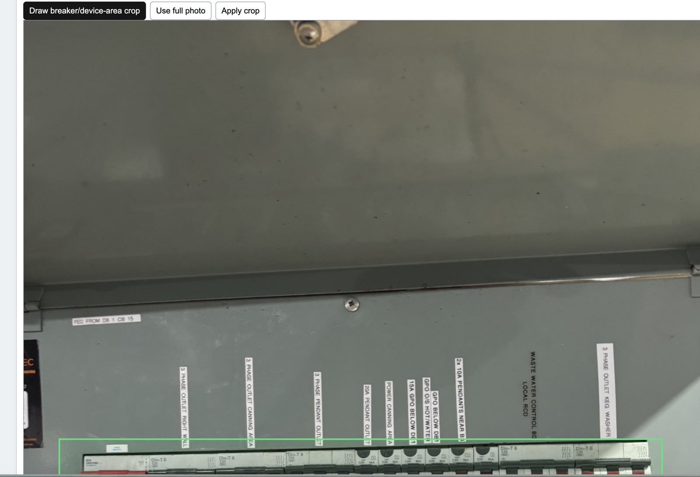
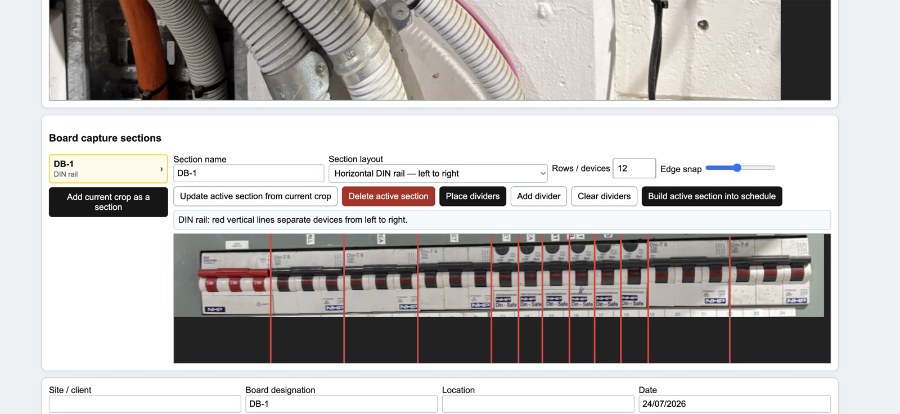
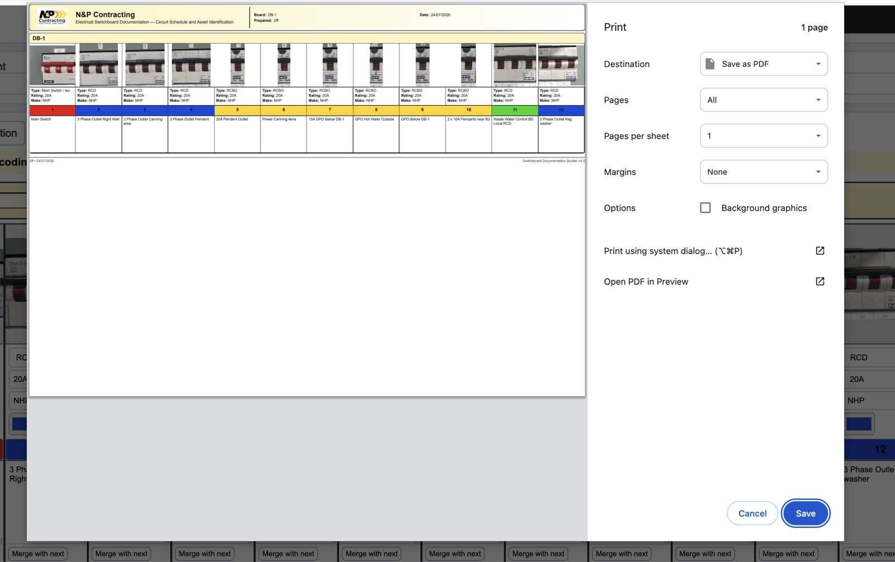

# Switchboard Documentation Builder v4.5

Create clear, professional electrical switchboard circuit schedules from site photographs—directly in your browser.

## What it does

Switchboard Documentation Builder turns switchboard photographs into structured circuit schedules and print-ready PDF reports. It is designed for field documentation, circuit identification, asset records and handover packs.

The app is a self-contained HTML tool. There is no installation, account or server-side database. Work is processed in the browser, and projects can be saved locally as JSON files for later editing.

## Features

- Add company branding, report titles, colours, contractor details and document references
- Support horizontal DIN rail, vertical chassis, mixed and custom board layouts
- Add board-overview and location photographs
- Rotate, crop and isolate breaker or device areas from a source photograph
- Divide a photographed row into individual devices using adjustable divider lines
- Record device type, rating, make/model, circuit number and connected load
- Apply colour coding for power, lighting, mechanical, fire, controls, UPS, emergency or custom categories
- Merge adjacent device spaces and rearrange schedule entries
- Create multiple board sections in horizontal or vertical layouts
- Save and reload complete projects as JSON
- Produce A4 or A3, portrait or landscape reports
- Adjust report density, devices per row, header size and included fields
- Print directly or save a polished report as PDF

## Typical workflow

1. Open the [live builder](https://jifinitely.github.io/switchboard-documentation-builder/).
2. Enter the report branding, board details and preferred PDF settings.
3. Add the switchboard and location photographs.
4. Upload the breaker/device photograph, rotate it if needed, and crop the active device area.
5. Create a capture section and place dividers between the devices.
6. Build the section into the schedule.
7. Enter the circuit numbers, device details, loads and colour coding.
8. Save the project JSON so it can be edited later.
9. Select **Print / Save as PDF** to create the final report.

## Screenshots

### Branding and report settings

Configure company branding, board format, PDF layout and included report fields.

### Photograph cropping

Rotate the source image, draw a crop around the breaker area, or use the full photograph.

### Device divider workflow

Split a photographed DIN rail or chassis into individual devices using adjustable divider lines.

### Circuit schedule editor

Review the extracted device images and add breaker details, circuit numbers, connected loads and colour coding.

### Print-ready PDF output

Generate a compact, branded circuit schedule using the browser’s print dialog and save it as a PDF.

## Saving projects

Select **Save project** to download a `.json` project file containing the current layout, images, branding and circuit details. Select **Load project** to continue editing that file later.

Keep the project JSON as the editable source record. A generated PDF is intended for distribution and printing, not for re-editing.

## Browser requirements

A current desktop version of Chrome, Edge, Safari or Firefox is recommended. A larger screen is helpful when positioning dividers and editing boards with many devices.

## Important notice

This tool assists with documentation only. It does not inspect electrical equipment, verify circuit operation, determine regulatory compliance or replace testing by a suitably qualified electrical worker. Confirm all circuit information and site requirements before issuing a final report.
